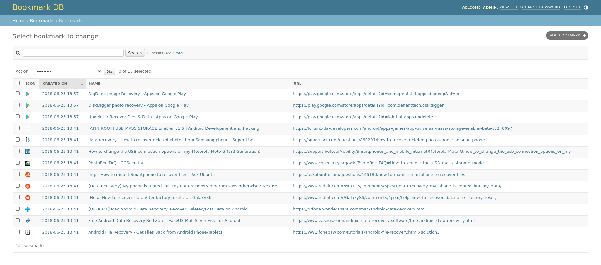
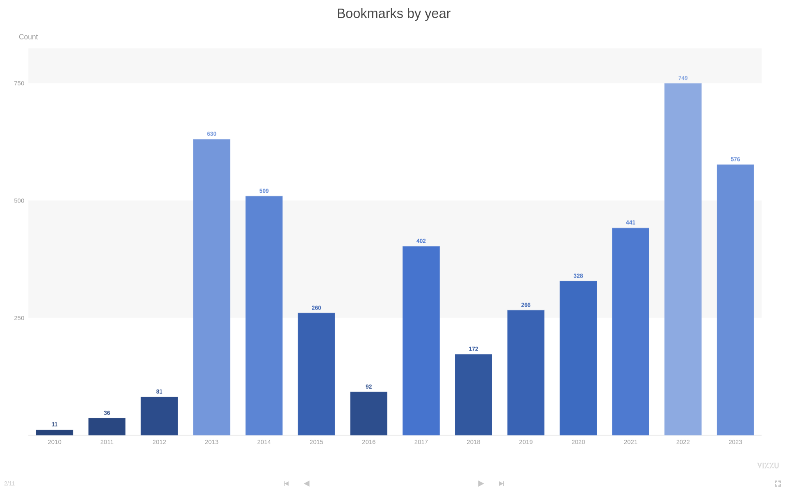
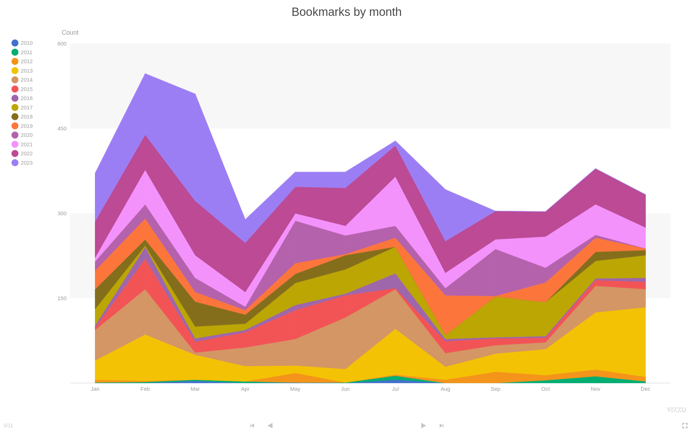
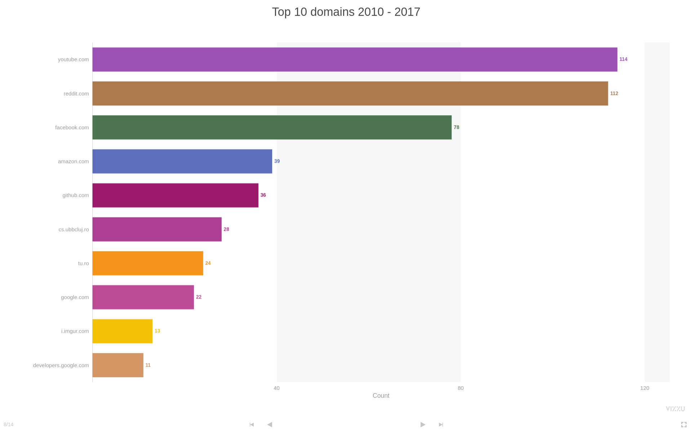

# Bookmark DB

Put your bookmark collection to good use

## What's this?

If  
you use `Export bookmarks` to save your old bookmarks to disk  
and  
you've got a collection of these files with chronological filenames e.g: 2020.html, 2021.html or 1.html, 2.html, etc.  
and  
you want to merge all this data and eliminate duplicate URLs,  
then  
Bookmark DB is for you.  
The project consists of 3 parts:

1. An importer, under `utils/importer.py` that parses bookmark files and returns bookmarks and labels (folder names)
2. A Django app that exposes the above importer as `./manage.py import`

3. A [JupyterLab](https://jupyter.org/) Notebook that uses [Vizzu](https://vizzuhq.com/) to produce visualizations of the above data

## How do I set this up for development?

    git clone git@github.com:g4b1nagy/bookmark_db.git
    cd bookmark_db/
    python3 -m venv venv
    source venv/bin/activate
    pip install -r requirements.txt
    ./bin/create_database_and_user.sh bookmark_db bookmark_db bookmark_db
    ./manage.py migrate
    DJANGO_SUPERUSER_PASSWORD="admin" ./manage.py createsuperuser --noinput --username admin --email admin@bookmark.db
    ./manage.py import utils/test_files/
    ./manage.py runserver
    go to http://localhost:8000/

## How do I run the tests?

    ./manage.py test
